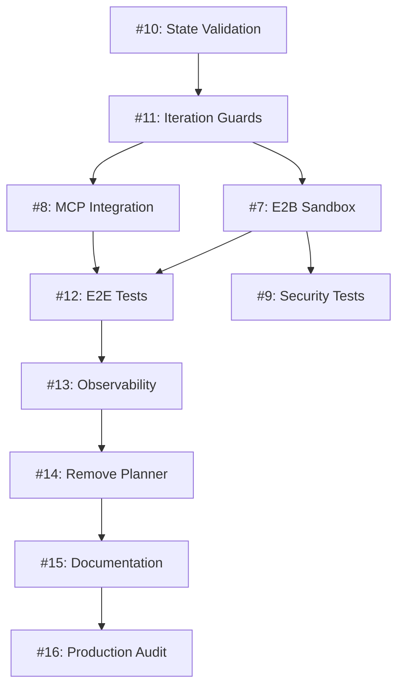

# ORACLE-OS Backlog Status Report
**Generated:** 2026-03-08
**Reference Issue:** #17 - Master Technical Backlog
**Architecture:** Quadripartite (Analyst → Reviewer → Executor → Synthesis)
**Reference Commit:** `97b5f46`

---

## 🎯 Executive Summary

The ORACLE-OS has successfully transitioned from a 3-stage architecture (Planner → Executor → Reviewer) to a 4-stage **Quadripartite Architecture** (Analyst → Reviewer → Executor → Synthesis). The core implementation is complete, but several hardening, integration, testing, and production-readiness tasks remain.

### Current State
- ✅ **Quadripartite Architecture implemented** in `src/graphs/oracle-graph.ts`
- ✅ **All 4 agent nodes functional**: Analyst, Reviewer, Executor, Synthesis
- ✅ **State schema defined** with typed stage outputs (ContextDocument, ExecutionBlueprint, ExecutedCode, SynthesisOutput)
- ✅ **Iteration guards present** (max 3 Reviewer↔Analyst loops)
- ✅ **Auto-correction in Executor** (detects and fixes common errors)
- ✅ **Short-term memory** between agents
- ✅ **Cost tracking** (CostTracker in Synthesis)
- ⚠️ **Some tests failing** (model configuration issues)
- ⚠️ **TypeScript compilation issues** (heap out of memory)
- ❌ **E2B Sandbox integration** (still using mocks/child_process)
- ❌ **MCP tool integration** (using mock tools)
- ❌ **Documentation outdated** (reflects old 3-stage architecture)

---

## 📋 Phase-by-Phase Analysis

### Phase 0: Pipeline Hardening `phase:0` (CRITICAL - Blocks all others)

#### Issue #10: Validate State Contracts
**Priority:** P0
**Status:** 🟡 PARTIAL
**Description:** Add runtime validation for state contracts between agents using Zod schemas

**Current Implementation:**
- ✅ Zod schemas exist in `src/agents/analyst.ts` (ContextDocumentSchema)
- ✅ Zod schemas exist in `src/agents/reviewer.ts` (BlueprintSchema)
- ✅ State types defined in `src/state/oracle-state.ts`
- ❌ No runtime validation at graph edges
- ❌ No validation error handling
- ❌ No schema tests

**What Needs to be Done:**
1. Create comprehensive Zod schemas for all stage outputs:
   - `ContextDocumentSchema` (Analyst output) ✅ EXISTS
   - `ExecutionBlueprintSchema` (Reviewer output) ✅ EXISTS
   - `ExecutedCodeSchema` (Executor output) ❌ MISSING
   - `SynthesisOutputSchema` (Synthesis output) ✅ EXISTS
2. Add validation middleware at each graph edge
3. Add error handling for validation failures
4. Create unit tests for all schemas

**Files Affected:**
- `src/state/oracle-state.ts` (add missing schemas)
- `src/graphs/oracle-graph.ts` (add validation at edges)
- `src/validation/` (new directory for validation logic)

---

#### Issue #11: Iteration Guards Runtime Validation
**Priority:** P0
**Status:** 🟡 PARTIAL
**Description:** Ensure iteration guards work correctly in all scenarios

**Current Implementation:**
- ✅ Max iterations config in `src/config.ts` (maxReviewerAnalystIterations: 3)
- ✅ Guard in Reviewer node (`src/agents/reviewer.ts:72-74`)
- ✅ Force-approve logic in Reviewer (`buildForceApproveResult()`)
- ✅ Guard in graph routing (`src/graphs/oracle-graph.ts:260-263`)
- ❌ No explicit tests for iteration guard behavior
- ❌ No logging/monitoring of guard triggers

**What Needs to be Done:**
1. Add comprehensive tests for:
   - Normal flow (approval on first try)
   - Revision flow (1-2 iterations)
   - Guard trigger (3+ iterations → force approve)
   - Edge cases (rejected status, errors during iteration)
2. Add telemetry for iteration guard triggers
3. Add explicit logging when guards activate
4. Document guard behavior in code comments

**Files Affected:**
- `src/agents/reviewer.test.ts` (add guard tests)
- `src/graphs/oracle-graph.test.ts` (add e2e guard tests)
- `src/monitoring/metrics.ts` (add guard telemetry)

---

### Phase 1: Infrastructure & Real Integrations `phase:1`

#### Issue #7: E2B Sandbox Integration (P0)
**Priority:** P0
**Status:** 🔴 NOT STARTED
**Description:** Replace `child_process` with E2B Sandbox SDK

**Current Implementation:**
- ✅ Executor agent structure (`src/agents/executor.ts`)
- ✅ Tool-calling loop (`runToolLoop()`)
- ❌ Currently uses mock tools or local `child_process`
- ❌ No E2B SDK integration
- ❌ No sandbox lifecycle management

**What Needs to be Done:**
1. Install E2B SDK: `npm install @e2b/sdk`
2. Create E2B sandbox manager:
   - Sandbox creation/teardown
   - Timeout handling
   - Error recovery
3. Refactor `runToolLoop()` to use E2B SDK
4. Add E2B authentication (API key from env)
5. Add sandbox isolation tests
6. Update documentation

**Files Affected:**
- `package.json` (add @e2b/sdk)
- `src/sandbox/` (new directory for E2B integration)
- `src/agents/executor.ts` (refactor to use E2B)
- `src/tools/tool-registry.ts` (update tool implementations)

---

#### Issue #8: MCP Integration (P1)
**Priority:** P1
**Status:** 🔴 NOT STARTED
**Description:** Replace mock tools with real Model Context Protocol integration

**Current Implementation:**
- ✅ Tool registry exists (`src/tools/tool-registry.ts`)
- ✅ Tool definitions exist (`src/tools/`)
- ❌ Tools are mocks or basic implementations
- ❌ No MCP server integration
- ❌ No MCP protocol implementation

**What Needs to be Done:**
1. Implement MCP client/server architecture
2. Connect to MCP servers (GitHub, filesystem, browser)
3. Implement tool discovery and registration
4. Add MCP authentication
5. Add error handling for MCP communication
6. Update tool implementations to use MCP

**Files Affected:**
- `src/mcp/` (new directory for MCP integration)
- `src/tools/tool-registry.ts` (refactor to use MCP)
- All tool files in `src/tools/`

---

### Phase 2: Testing & Validation `phase:2`

#### Issue #12: E2E Integration Tests (P1)
**Priority:** P1
**Status:** 🔴 NOT STARTED
**Dependencies:** #10, #11
**Description:** Create end-to-end tests for the full Quadripartite pipeline

**What Needs to be Done:**
1. Create test fixtures for each stage
2. Test full pipeline flow (Analyst → Reviewer → Executor → Synthesis)
3. Test iteration loops (Reviewer → Analyst)
4. Test error handling at each stage
5. Test state persistence across stages
6. Add performance benchmarks

**Files to Create:**
- `src/graphs/oracle-graph.e2e.test.ts`
- `tests/fixtures/` (test data)
- `tests/integration/` (integration test suite)

---

#### Issue #9: Sandbox Isolation & Security Tests
**Priority:** P1
**Status:** 🔴 NOT STARTED
**Dependencies:** #7
**Description:** Validate E2B sandbox isolation and Reviewer Red Team capabilities

**What Needs to be Done:**
1. Test sandbox isolation (no file system escape)
2. Test resource limits (CPU, memory, network)
3. Test Reviewer Red Team patterns (security risk detection)
4. Test malicious code detection
5. Add security scanning to CI/CD

**Files to Create:**
- `tests/security/sandbox-isolation.test.ts`
- `tests/security/red-team.test.ts`

---

### Phase 3: Observability & Tracing `phase:3`

#### Issue #13: Trace ID and Structured Logging (P2)
**Priority:** P2
**Status:** 🟡 PARTIAL
**Description:** Add trace IDs, span timing, and structured logging per agent

**Current Implementation:**
- ✅ Basic logging exists (`src/monitoring/logger.ts`)
- ✅ Cost tracking exists (`src/monitoring/cost-tracker.ts`)
- ❌ No trace IDs
- ❌ No span timing
- ❌ Logs not structured (no JSON format)

**What Needs to be Done:**
1. Generate trace ID per pipeline execution
2. Add span timing for each agent
3. Convert to structured JSON logging
4. Add OpenTelemetry integration (optional)
5. Add dashboard for trace visualization

**Files Affected:**
- `src/monitoring/tracer.ts` (new file)
- `src/monitoring/logger.ts` (refactor to structured logs)
- `src/graphs/oracle-graph.ts` (add trace context)

---

### Phase 4: Production Readiness `phase:4`

#### Issue #14: Remove Planner Aliases (P2)
**Priority:** P2
**Status:** 🟢 EASY WIN
**Description:** Remove deprecated Planner backward compatibility code

**Current Implementation:**
- ⚠️ `config.agents.planner` exists in `src/config.ts:72`
- ⚠️ `plannerAgent()` export in `src/agents/planner.ts`
- ⚠️ Old documentation references Planner

**What Needs to be Done:**
1. Remove `config.agents.planner` from `src/config.ts`
2. Remove/deprecate `src/agents/planner.ts` file
3. Remove `planner` references in tests
4. Update all imports to use `analyst`

**Files Affected:**
- `src/config.ts`
- `src/agents/planner.ts` (delete or mark deprecated)
- `src/agents/planner.test.ts` (migrate to analyst.test.ts)
- Any files importing from planner.ts

---

#### Issue #15: Update Documentation (P2)
**Priority:** P2
**Status:** 🔴 NOT STARTED
**Dependencies:** #14
**Description:** Update README, AGENTS.md, and RUNBOOK.md to reflect Quadripartite Architecture

**Current State:**
- ❌ `README.md` shows old 3-stage architecture
- ❌ `AGENTS.md` describes Planner → Executor → Reviewer
- ❌ Prompts still reference old patterns

**What Needs to be Done:**
1. Update README.md:
   - Architecture diagram (4 stages)
   - Quick start guide
   - API reference
2. Update AGENTS.md:
   - Analyst, Reviewer, Executor, Synthesis roles
   - State contracts
   - Flow diagrams
3. Update RUNBOOK.md:
   - Troubleshooting for new architecture
   - Common issues
   - Monitoring guides
4. Update inline documentation

**Files Affected:**
- `README.md`
- `AGENTS.md`
- `RUNBOOK.md`
- `ORACLE_KNOWLEDGE_BASE.md`
- `docs/*.md`

---

#### Issue #16: Production Readiness Audit (P1)
**Priority:** P1
**Status:** 🔴 NOT STARTED
**Dependencies:** ALL PREVIOUS PHASES
**Description:** Full production readiness checklist and implementation

**What Needs to be Done:**
1. Security audit
2. Performance benchmarking
3. Error handling audit
4. Monitoring and alerting setup
5. CI/CD pipeline
6. Deployment documentation
7. Backup and recovery procedures
8. Load testing
9. API rate limiting
10. Authentication and authorization

**Deliverables:**
- Production checklist document
- Load test results
- Security scan reports
- Deployment runbook
- Monitoring dashboard

---

## 🚦 Recommended Execution Order

### Week 1: Phase 0 - Foundation
- Day 1-2: Issue #10 (State validation)
- Day 3-4: Issue #11 (Iteration guards)
- Day 5: Integration and testing

### Week 2: Phase 1 - Infrastructure
- Day 1-3: Issue #7 (E2B Sandbox)
- Day 4-5: Issue #8 (MCP Integration)

### Week 3: Phase 2 - Testing
- Day 1-3: Issue #12 (E2E tests)
- Day 4-5: Issue #9 (Security tests)

### Week 4: Phase 3 - Observability
- Day 1-5: Issue #13 (Trace ID & logging)

### Week 5: Phase 4 - Production
- Day 1: Issue #14 (Remove Planner aliases)
- Day 2-3: Issue #15 (Documentation)
- Day 4-5: Issue #16 (Production audit)

---

## 🎯 Quick Wins (Can Start Immediately)

1. **Issue #14** - Remove Planner aliases (~2 hours)
   - Low risk, high clarity improvement
   - Reduces technical debt

2. **Fix failing tests** - Update test configurations (~4 hours)
   - Fix model configuration in tests
   - Update test assertions for Quadripartite flow

3. **TypeScript compilation fix** - Investigate heap issue (~2 hours)
   - May need to increase heap size or optimize types

---

## 📊 Current Test Status

### Passing Tests (✅)
- `src/tools/extended-tools.test.ts` (17 tests)
- `src/graphs/oracle-graph.test.ts` (4 tests)
- `src/monitoring/cost-tracker.test.ts` (9 tests)
- `src/rag/dynamic-indexer.test.ts` (9 tests)
- `src/agents/executor.test.ts` (5 tests)
- `src/rag/rag.test.ts` (4 tests)

### Failing Tests (❌)
- `src/prompts/enhancer.test.ts` (2/9 failed) - Model config issue
- `src/agents/planner.test.ts` (5/5 failed) - Model config issue
- `src/agents/reviewer.test.ts` (3/4 failed) - Model config issue

**Root Cause:** Tests reference models that aren't properly mocked/configured in test environment.

---

## 📝 Notes

- The Quadripartite Architecture is **well-implemented** at the core level
- Main gaps are in **integration** (E2B, MCP), **testing**, and **documentation**
- Test failures are configuration issues, not architectural flaws
- Strong foundation for building production-ready system

---

**Next Action:** Choose which phase/issue to tackle first based on project priorities.
